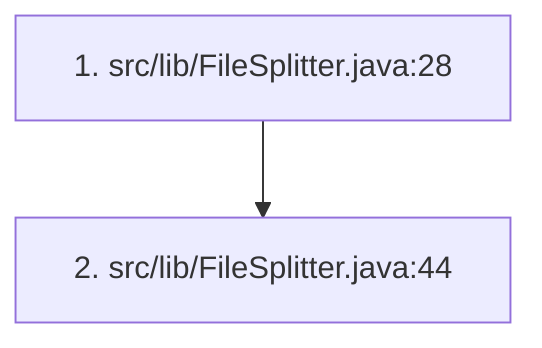

# testing



## 1. src/lib/FileSplitter.java:28

**Review Note:** added new split

```
        private String splitPrefix;
```

---

## 2. src/lib/FileSplitter.java:44

**Review Note:** this is how we define the split start and stop, start will change

```
                String seekTo = String.format("%02d:%02d:%02d", (int) (i * timePerSplit.toSeconds()) / 3600,
                        (int) (((i * timePerSplit.toSeconds()) % 3600) / 60),
                        (int) (i * timePerSplit.toSeconds()) % 60);

                // Finish split at
                String finish = String.format("%02d:%02d:%02d", (int) ((i+1) * timePerSplit.toSeconds()) / 3600,
                        (int) ((((i + 1) * timePerSplit.toSeconds()) % 3600) / 60),
                        (int) ((i + 1) * timePerSplit.toSeconds()) % 60);
```
